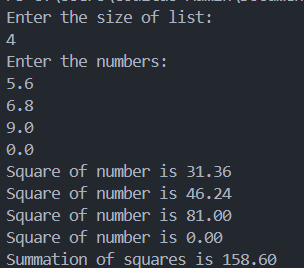

Problem statement:

Write a code to squares numbers from a list concurrently and aggregates the squared values.

Goroutines and Channels:
Implement a function squareWorker that takes a number, computes its square, and sends the result through a channel.

Aggregation Function:
Implement a function aggregateSquares that receives squared numbers from the channel, sums them up, and prints the final result.

Wait Group:
Use a wait group to ensure that all goroutines finish their tasks before the program exits. 

